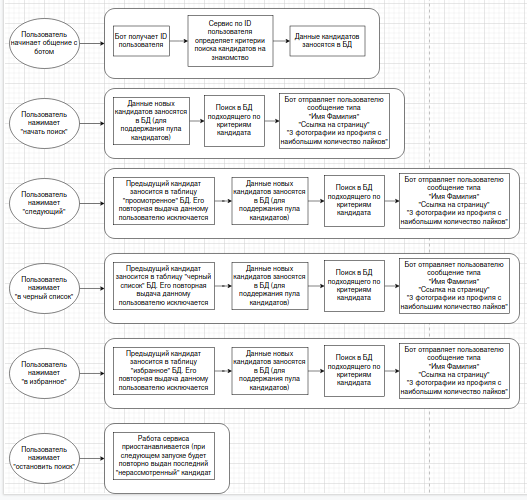

# VKinder  	:heart:
# Поможет Вам найти любовь в Вашем городе!

## Как начать знакомиться?

### Чтобы начать знакомиться Вам нужна действующая учетная запись в социальной сети [ВК](https://vk.com/).
### Пожалуйста, проверьте, указана ли у Вас дата рождения, город проживания, Ваш пол и не закрыта ли Ваша страница. Без этого сервис не сможет понять, какие из миллионов пользователей ВК подходят именно Вам.
### Если все готово - переходите в диалог с [ботом](https://vk.com/public216216029). Удачных знакомств!

## Для разработчиков
### Для работы сервиса требуется:
- ключ доступа (токен) пользователя
- ключ доступа (токен) сообщества
### Схема работы сервиса


## Подробное описание работы сервиса
### Взаимодействие с ВК.
```
me = VK(vk_user_token)
```
Экземпляр класса VK, с помощью которого осуществляется взаимодействие с API ВК.<br/>На вход принимается ключ доступа (токен) пользователя.

```
VK_part.me.get_user_and_persons_info_from_vk(user_id: int)
```
На входе ID пользователя, который общается с ботом.<br/>На выходе список со списками (nested list).<br/>Вложенные списки имеют 6 элементов и содержат информацию о подходящих под критерии поиска людях (кандидатах):<br/>[ID кандидата, Имя кандидата, Фамилия кандидата, ID фото №1, ID фото №2, ID фото №3].<br/>Фотографии отбираются из профиля, берутся фотографии с наибольшим количеством лайков.<br/>Кандидаты с закрытыми профилями и имеющие меньше 3 фотографий профиля отсеиваются.
### Взаимодействие с БД.
```
vkinder = VKinderDB()
```
Экземпляр класса VKinderDB, с помощью которого осуществляется взаимодействие с БД с помощью sqlalchemy.

```
database.vkinder_db.vkinder.get_data(table: str, data: dict)
```
Проверка наличия в таблице table данных data.

```
database.vkinder_db.vkinder.insert_data(table: str, data: dict)
```
Добавление в таблицу table данных data, если такие данные в ней отсутствуют.
```
database.vkinder_db.vkinder.get_user_photos(user_id: int) 
```
На входе ID одного из находящихся в БД людей.<br/>На выходе список из 3-х url фотографий.
```
database.vkinder_db.vkinder.get_user_info_to_search(user_id: int) 
```
На входе ID пользователя, общающегося с ботом.<br/>На выходе список критериев (возраст, пол, город) для поиска подходящих конкретному пользователю людей по БД.
```
database.vkinder_db.vkinder.get_user_info_to_send(some_list: list):
```
На входе список критериев поиска.<br/>На выходе список списков (nested list) подходящих под критерии людей (в каждом вложенном списке ID, имя, фамилия, url подходящего человека).
```
database.vkinder_db.vkinder.get_info_and_photo_to_send(user_id: int)
```
На входе ID пользователя, общающегося с ботом.<br/>На выходе список списков (nested list) с полной информацией о подходящих под критерии поиска людях из БД.<br/>(в каждом вложенном списке ID, имя, фамилия, url, photo_url №1, photo_url №2, photo_url №3).
```
database.vkinder_db.vkinder.insert_new_data_from_vk(user_id: int)
```
На входе ID пользователя, общающегося с ботом.<br/>Добавление в БД информации о пользователе и подходящих под его критерии поиска людях.<br/>Информация о самом пользователе будет добавлена в БД только в том случае, если у него больше 3 фото в профиле.
```
database.vkinder_db.vkinder.check_seen_persons(user_id: int, person_id: int):
```
На входе ID пользователя, общающегося с ботом, и ID подходящего под критерии поиска кандидата.<br/>Проверка кандидата на присутствие в "избранном", "черном списке" и "просмотренном".
```
database.vkinder_db.vkinder.get_person_to_send(user_id: int)
```
На входе ID пользователя, общающегося с ботом.<br/>Поиск в БД одного подходящего под критерии поиска кандидата, отсутствующего в "избранном", "черном списке" и "просмотренном".
```
database.vkinder_db.vkinder.add_seen_person_to_database(table: str, user_id: int, person_id: int)
```
На входе ID пользователя, общающегося с ботом, ID кандидата, которого пользователь добавил в "избранное", "черный список" или "просмотренное" и название соответствующей таблицы БД.<br/>Добавление кандидата в "избранное", "черный список" или "просмотренное" и исключение его из повторной выдачи данному пользователю.

По всем вопросам:<br/>[Тимур Котельников](https://github.com/Timur-Kotelnikov),<br/>[Михаил Колесниченко](https://github.com/Wooft),<br/>[Герман Иванов](https://github.com/Gerry1Laxy). 
